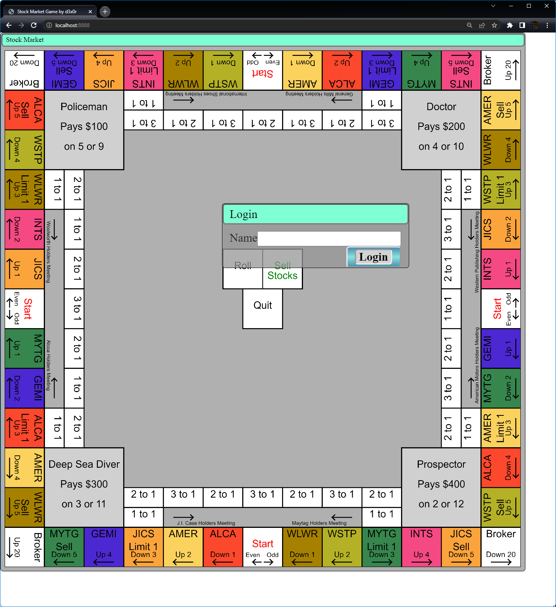

# Stock Market Game

This is a Node.JS server using [sack.vfs](https://github.com/d3x0r/sack.vfs) for websockets and HTTP service; [JSOX](https://github.com/d3x0r/jsox) for message encoding; 
[@d3x0r/Popups](https://github.com/d3x0r/popups) for user interface dialogs.

Serves a webpage to play a game.

## Howto

Squares you can move to or select are highlighted in gold.

Your current square is highlighted in pink.

In the beginning, you have to earn money by working at a job; the 4 squares in the center are various professions.  Each player takes a turn rolling the dice, and if
the number on the profession matches the dice, the player is payed that wage.  Once a player rolls and is paid a total of $1000, they must enter the stock market ring at a start square.
If a player begins their turn with $1000 or more, they must select a start space before rolling.

Around the stock market ring, squares have a direction that you must go as specified.  If you own some of a stock, when passing past a holders meeting square (Marked with `Limit 1`), you
may enter the stock holders meeting track, which will give you an amount of shares shown in the square for ever share you already own.

The Broker's Fee squares in the corners charge $10 per share; If you do not have enough cash to pay, you must sell stocks at the minimum market value to cover the cost.  If you still don't have 
enough money, you will be bankrupt, your cash will be reset to $0 and you will return to the workplace, and have to earn money.

On the corners are squares marked `Sell`; this require you to sell all shares of a stock (at minimum? at current market?).

At any time before the dice are rolled, you may sell stocks; this will make the sale at the current market value.

Most stock squares when you land on them, you may buy any amount of that stock at the current market price; at the meetings for stock holders, you are limited to purchasing 1 share.  These square will
also pay a dividend to each player, for each share they own of a stock.

Squares are also marked with `Up` and `Down` indicators which change the current market value.  When you move to these squares, this change is applied immediately.

`Quit` allows you to sign out of a game.  If you merely close your client and disconnect, your game will remain with you as a participant for the next time you login.

## Privacy Statement

The Application asks for a username to start; Please keep this clean and repectful to general audiences.  

The selected name is saved in the `localStorage` facility; which is private to this application.  It requires some small amount of storage for the name and value tags in a database somewhere.  The username is sent
automatically upon connection with the application server to identify you.  This name will be used in the Lobby facility and shown to anyonee in the lobby.

Creating a game will use your entered name plus a string to make a name of a game.  This game name will appear on the list of available games for players in the lobby to join.

Once you are entered into a game, you are removed from the lobby; Upon re-connection to the same user account, you will resume in the game you left; until you quit that game.

Players are only allowed a single connection, a second connection will disconnect the first; and it may be generate periodic continuous reconnects.

The last player to leave a game will delete the game from the server.

The server currently only has a memory image of the games, and does not persist any games or users in any storage.

Normally server logs will not include your IP; although (un)certain error conditions may log the connection information.